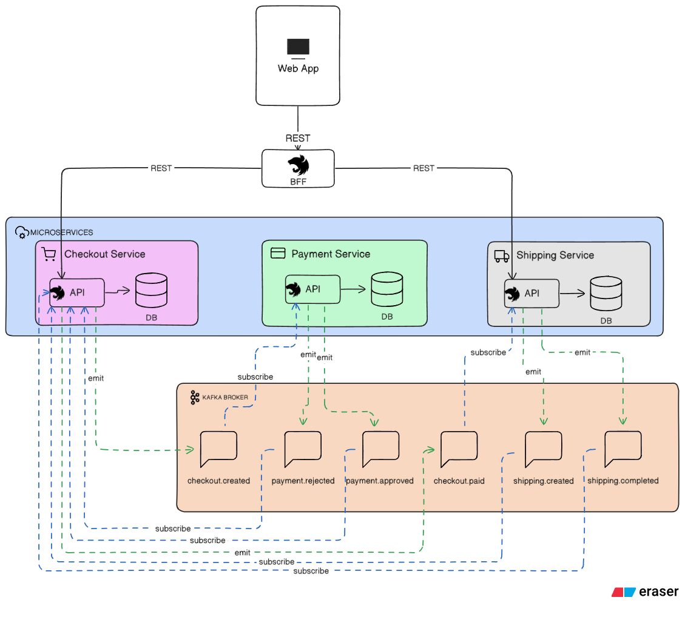

# E‑Commerce Checkout Microservices

## Teste Prático – Back‑end

**Desafio:**  
Criar uma API REST utilizando NestJS, seguindo uma arquitetura baseada em eventos, adotando um modelo de microserviços e o padrão Backend for Frontend (BFF) para expor os dados ao frontend.

---

## Objetivo do Teste

- Dividir responsabilidades em 3 microserviços:
  - **Checkout Service** (processar compra + orquestrador)
  - **Payment Service** (processa pagamento)
  - **Shipping Service** (gera expedição)
- Comunicação assíncrona via eventos (Kafka).
- Padrão BFF.
- Docker Compose para ambiente de dev.
- Uso de um ORM.
- Testes nos principais fluxos.

---

## Projeto & Desenho da Solução

1. **Arquitetura geral:**  
     
   - Cada serviço roda isoladamente em sua própria rede Docker privada para segurança.
   - O **Checkout Service** atua como orquestrador do fluxo de compra, mantém algumas informações sobre o restante dos serviços para facilitar consulta.
   - BFF conecta Front‑end ⇄ microserviços via REST unificado.
    - OBS: Optei por fazer assim para simplificar a busca, mas poderia ter implementado no BFF uma chamada que consultasse os outros microserviços e reunisse as informações para devolver ao front

2. **Fluxo de eventos (Diagrama de Sequência):**  
     
   1. Front‑end → BFF → Checkout Service cria pedido.
   2. Checkout emite `checkout.created` → Payment Service.
   3. Payment processa e emite `payment.approved` ou `payment.rejected`.
   4. Em caso de aprovação, Checkout atualiza status e emite `checkout.paid`.
   5. Shipping Service cria ordem e emite `shipping.created`.
   6. Fluxo finaliza com `shipping.completed`.

3. **Esquemas de banco de dados:**  
   - **Checkout DB**  
       
   - **Payment DB**  
       
   - **Shipping DB**  
     

---

## Decisões Técnicas

### NestJS + TypeORM  
- **TypeORM** para mapear entidades (Checkout, CheckoutItem, Payment, Shipping, Address)  
- Transações simples e migrações automatizadas  
- Forte integração com decorators e DI do NestJS

### Kafka (NestJS Microservices)  
- Comunicação de Eventos
- Tópicos usados:
  - `checkout.created`
  - `payment.approved` / `payment.rejected`
  - `checkout.paid`
  - `shipping.created` / `shipping.completed`  

---

## Como Rodar

Pré‑requisitos:
- Docker & Docker Compose  
- Node.js v16+  
- npm  

```bash
# 1. Clonar repositório
git clone https://github.com/joaogjoao/checkout-microservices.git
cd checkout-microservices

# 2. Iniciar ambiente Docker
docker-compose up --build -d 
```

## Testes
- O foco principal dos testes está no **Checkout Service**, que orquestra todo o fluxo de compra

```bash
# Acesse a pasta do serviço
cd checkout-service

# Instalar dependências
npm install

# Rodar testes
npm run test:cov
```

## Documentação da API
- **BFF/Swagger**: http://localhost:3000/api-docs
- **BFF**: http://localhost:3000/bff

---

## Testando a Aplicação via Postman (Funciona para Swagger também)

Siga estes passos para validar todo o fluxo de ponta a ponta:

1. **Importar a Collection**  
   - No Postman: **File → Import** → selecione `docs/APICollection.postman_collection.json`.

2. **Estrutura da Collection**  
   - **REJECTED**: Chamadas que vao ter pagamento rejeitado devido a logica de validação: Maximo 1000 de valor
   - **APPROVED**: Chamadas que vao ter pagamento aprovado
   - **BadRequest**: Chamadas com erro no formato
   - Chamada do GET/ checkout/id - Devolve dados do checkout
   - Chamada do POST/ shipping/id/complete que finaliza o processo de envio (caso chamado duas vezes para mesmo ShippingId retorna erro que o status não aceita a ação)


3. **Executar as Requisições na Sequência**  
   1. **Create Checkout**  
      - Método: `POST http://localhost:3000/bff/checkout`  
      - Body: JSON com itens, endereço, etc.  
      - Copie o campo `id` da resposta.  
   2. **Consultar Checkout**  
      - Método: `GET http://localhost:3000/bff/checkout/{{checkoutId}}`
      - Copie o campo `shippingId` da resposta.    
   3. **Completar Entrega**  
      - Método: `POST http://localhost:3000/bff/shipping/{{shippingId}}/complete`  
   5. **Consultar Fluxo Completo**  
      - Método: `GET http://localhost:3000/bff/checkout/{{checkoutId}}`  
      - Confira `paymentStatus`, `shippingStatus` e demais campos.

